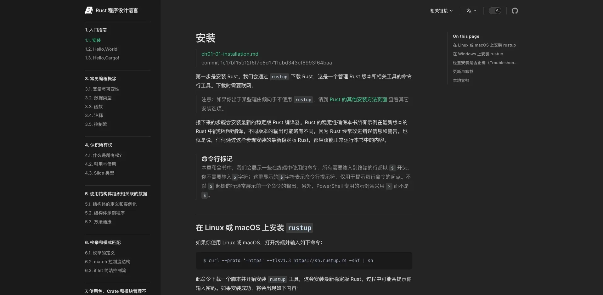

# Rust 程序设计语言 简体中文版

* [原仓库地址](https://github.com/KaiserY/trpl-zh-cn)
* [在线地址](https://tomxuetao.github.io/rust-book-chinese/)


* 对照源码位置：[https://github.com/rust-lang/book/tree/main/src][source]
* 每章翻译开头都带有官方链接和 commit hash，若发现与官方不一致，欢迎 Issue 或 PR :)

[source]: https://github.com/rust-lang/book/tree/main/src

## 静态页面构建与文档撰写



## 构建

我们采用 [vitepress](https://vitepress.vuejs.org/) 打包出静态网页。在这之前，你需要安装 [Nodejs](https://nodejs.org/zh-cn/)。

cd 到项目目录，安装包

``` bash
pnpm install
```

构建好的静态文档会出现在 "./.vitepress/dist" 中

```bash
pnpm run build
```

## 文档撰写

vitepress 会启动一个本地服务器，并在浏览器对你保存的文档进行实时热更新。

```bash
pnpm run dev
```

## 社区资源

- Rust语言中文社区：<https://rust.cc/>
- Rust English: <https://doc.rust-lang.org/book/>
- Rust 简体中文：<https://kaisery.github.io/trpl-zh-cn/>

## PDF

[Rust 程序设计语言 简体中文版.pdf](https://kaisery.github.io/trpl-zh-cn/Rust%20%E7%A8%8B%E5%BA%8F%E8%AE%BE%E8%AE%A1%E8%AF%AD%E8%A8%80%20%E7%AE%80%E4%BD%93%E4%B8%AD%E6%96%87%E7%89%88.pdf)
